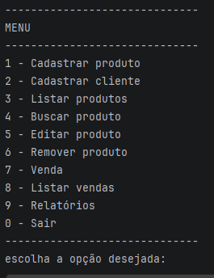
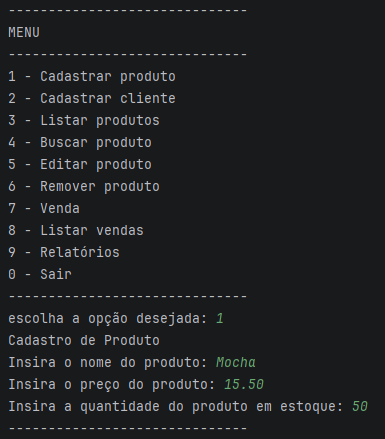
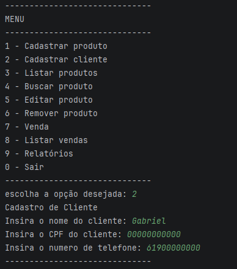
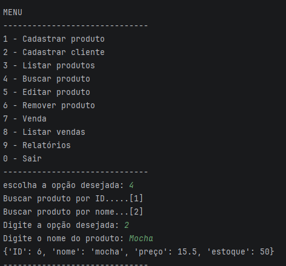
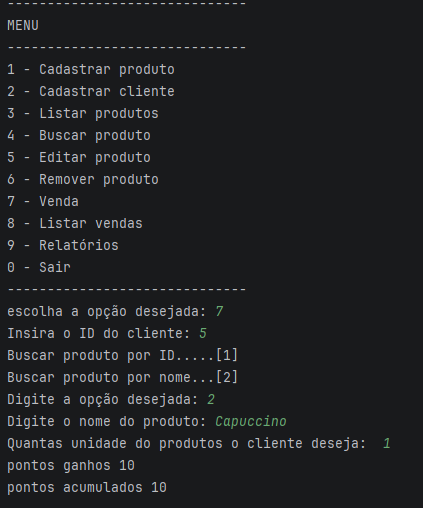
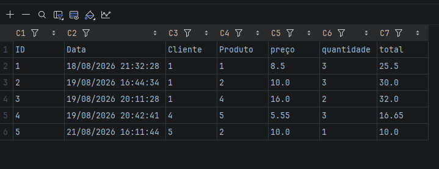
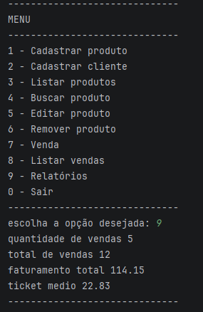
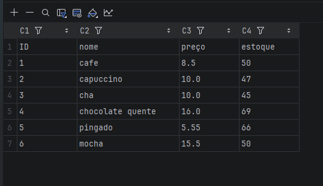
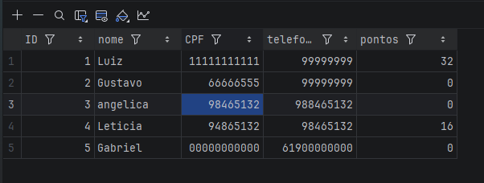

### 1 DESCRIÇÃO DO PROJETO

    O projeto consiste no desenvolvimento de um sistema em Python destinado a auxiliar o gerenciamento de uma cafeteria,
    simulando funcionalidades e atendimento e organização interna.
    A proposta do sistema apresenta uma situação-problema que destaca as dificuldades relacionadas ao controle de 
    pedidos, organização das informações dos produtos e cadastro de clientes.
    O sistema busca oferecer uma solução simples, organizada e fácil de utilizar.

### 2 OBJETIVO DO PROJETO

    O projeto tem como objetivo desenvolver uma solução em Python que simule funcionalidades de gerenciamento e atendimento
    de uma cafeteria, incluindo cadastro de produtos, clientes e pedidos. O desenvolvimento também busca aplicar na prática 
    os conceitos estudados na disciplina de Lógica, Algoritmos e Programação de Computadores utilizando estruturas como listas,
    dicionários e funções, além de uma interface simples para interação com o usuário.

### 3 TECNOLOGIAS E RECURSOS UTILIZADOS

    * Python
    * PyCharm
    * Git
    * GitHub
    * Listas
    * Dicionários
    * Funções
    * Estrutura condicional
    * Estrutura de repetição

    O código foi organizado em módulos para facilitar a manutenção e a compreensão do projeto.

### 4 ESTRUTURA DO PROJETO

    cafe_shop_faculdade/
      │
      ├── main.py
      ├── funcoes.py
      ├── arquivos.py
      ├── interface.py
      └── .gitignore

    main.py
    É responsável pelo fluxo principal da aplicação, por controlar a execução do menu e utilizar as funções responsáveis pelas
    operações do sistema.

    funcoes.py
    Contém as funções responsáveis pelas principais operações do sistema, como cadastro, linguagem e busca de produtos.

    arquivos.py
    Módulo reservado para as operações relacionadas ao armazenamento de dados em arquivos.

    interface.py
    Módulo destinado à organização da interface e da interação com o usuário.

    .gitignore
    Arquivo utilizado para impedir que arquivos e diretórios desnecessários sejam enviados ao repositório Git.

### 5 ESTRUTURA DE DADOS

    Os produtos são armazenados em uma lista de dicionários
    EXEMPLO: produto = [{"ID": 1, "nome": "cafe", "preco": 8.50, "estoque": 50}, {"ID": 2, "nome": "capuccino",
    "preco": 10.00, "estoque": 50}]

    Os clientes são representados por dicionários e armazenados em uma lista.

### 5.1 FUNÇÃO cadastrar_produto()

    A função cadastrar_produto() é responsável por coletar os dados de um novo produto e organizar essas informações em   um
    dicionário que posteriormente será armazenado em uma lista de produtos.

    ASSINATURA:
  
    def cadastrar_produto(produtos):

    a função recebe como parâmetro a lista de produtos que contém os produtos já cadastrados, essa lista é usada para 
    determinar o identificador do novo produto.

    ETAPAS DE EXECUÇÃO

    1. Exibição do título da operação:
     
     A função inicia apresentando uma mensagem informando que o usuário está realizando o cadastro de um produto.
     print("Cadastro de Produto")
     Essa mensagem tem a finalidade de orientar o usuário durante a execução do sistema.
     
    2. Criação do dicionário do produto:

     Um dicionário vazio é criado para armazenar os dados referentes ao novo produto.
     produto ={}
     A partir desse momento, as informações coletadas serão adicionadas ao dicionário utilizando chaves específicas.
     
    3. Geração do identificador:

     O sistema verifica se a lista de produtos está vazia, para criar o ID inicial do produto utilizando a fórmula:
     
        if not produtos:
            proximo_id = 1
        else:
            proximo_id = max(produto["ID"] for produto in produtos) +1

    4. Armazenamento do ID:

     O identificador calculado é armazenado no dicionário do produto:

     produto["ID"] = proximo_id

     Esse valor será utilizado posteriormente para identificar o produto nas operações de busca, edição e remoção.
     
    5. Cadastro do nome:
     
     O sistema solicita ao usuário o nome do produto:

     produto["nome"] = ...

     o nome é armazenado no dicionário  utilizando a chave "nome".
     
     6. Cadastro do preço:

      O preço informado pelo usuário é convertido para o tipo float, permitindo o trabalho com valores monetários          que possuam casas decimais.

     produto["preço"] = float(...)
     
    7. Cadastro do estoque:

     A quantidade inicial disponível no estoque é recebida pelo sistema e convertida para o tipo int.

     produto["estoque"] = int(...)
     
    8. RETORNO DO PRODUTO

     Depois que todos os dados são preenchidos, a função retorna o dicionário criado:

     return produto

     Esse retorno permite que o programa principal receba o novo produto e adicione-o à lista:

     novo_produto = cadastrar_produto(produtos)
     produtos.append(novo_produto)

     Estrutura resultante:

     {"ID": 1 , "nome": "cafe" , "preço": 8.50 , "estoque": 50}

     RESUMO DO FLUXO

     recebe lista de produtos > gerar id > criar dicionário > receber nome > receber preço > receber estoque > retornar produto.
  
### 5.2 FUNÇÃO listar_produtos()

    A função listar_produtos() é responsável por percorrer a lista de produtos cadastrados e apresentar na tela as 
    principais informações de cada produto.
    A função recebe como parâmetro a lista de produtos que contém dicionários representando os produtos cadastrados.

### ASSINATURA

    def listar_produtos(produtos)

    O parâmetro produtos representa a coleção de produtos armazenados pelo sistema.

### ETAPAS DE EXECUÇÃO

    1.PERCORRER A LISTA DE PRODUTOS
    A função utiliza uma estrutura de repetição for para percorrer cada elemento da lista:
      
    for produto in produtos:

    A cada repetição, a variável produto representa um dos dicionários armazenados na lista, por exemplo:

    { "ID": 1, "nome": "cafe", "preço": 8.50, "estoque": 50 }}=
  
    2. APRESENTAR UM SEPARADOR VISUAL

    Antes de exibir os dados, a função utiliza uma sequência de caracteres para separar visualmente os produtos:

    print("-" * 30)

    A expressão "-" * 30 produz uma sequência contendo 30 caracteres -.

    3. EXIBIR O IDENTIFICADOR DO PRODUTO

    O ID é obtido diretamente do dicionário:

    print(f"ID - {produto['ID']}")

    A chave "ID" permite acessar o identificador armazenado no produto.

    4. EXIBIR O NOME DO PRODUTO

    O nome é acessado pela chave "nome":

    print(f"produto.....{produto['nome']}")

    5. EXIBIR O PREÇO

    O preço é acessado pela chave "preço":

    print(f"preço.......{produto['preço']}")

    O valor armazenado no dicionário é utilizado diretamente na apresentação.

    6. EXIBIR A QUANTIDADE DE ITENS EM ESTOQUE

    A quantidade disponível é apresentada por meio da chave "estoque":

    print(f"estoque.....{produto['estoque']}")

    7. ENCERRAR A APRESENTAÇÃO DO PRODUTO

    Ao final de cada iteração, outro separador é apresentado:

    print("-" * 30)

    Depois disso, o for continua para o próximo produto da lista.

    Exemplo de execução

    Considerando a seguinte lista:

    produto = [{"ID": 1 , "nome": "cafe" , "preço": 8.50 , "estoque": 50} , {"ID": 2 , "nome": "capuccino" , "preço": 10.0 , "estoque": 50}]

    A função apresenta:


    ID - 1
    produto.....cafe
    preço.......8.50
    estoque.....50
    
    ID - 2
    produto.....capuccino
    preço.......10.0
    estoque.....50

    Estrutura utilizada
    
    A função trabalha com duas estruturas principais:
    
    lista > produtos > dicionários > ID, nome, preço e estoque
    
    A lista permite armazenar vários produtos, enquanto cada dicionário organiza as informações de um produto individual.
    
    Retorno
    
    A função não utiliza return. Sua responsabilidade é apresentar os produtos diretamente na interface de execução.
    
    Resumo do fluxo
    
    Receber lista de produtos > Percorrer cada produto > Acessar os dados do dicionário > Exibir ID > Exibir nome > Exibir preço > Exibir estoque > Passar para o próximo produto

### 5.3 FUNÇÃO buscar_produto()

    A função buscar_produtos() é responsável por localizar um produto cadastrado no sistema a partir de informações fornecidas pelo usuário.
    A busca pode ser realizada utilizando o ID ou o nome do produto.
    para facilitar a pesquisa por nome, o sistema utiliza uma função de normalização de texto, permitindo tratar diferenças relacionadas a letras maiúsculas, minúsculas e acentuação.

### ASSINATURA

    def buscar_produtos(produtos):
    
    A função recebe como parâmetro a lista produtos, que contém os dicionários correspondentes aos produtos cadastrados.
    
    1.ESCOLHA DO TIPO DE BUSCA
    
    O sistema solicita ao usuário qual informação será utilizada para localizar o produto.
    A partir da opção selecionada, a função segue um fluxo específico para buscar por ID ou por nome.
    
    2.BUSCA POR ID  
    
    Quando o usuário escolhe pesquisar pelo identificador, o sistema solicita o ID desejado.
    O valor informado é convertido para um tipo numérico, para que possa ser comparado com o valor armazenado no dicionário do produto.
    A busca utiliza uma expressão geradora em conjunto com next():
    
    resultado = next((produto for produto in produtos if produto["ID"] == buscador), False)
    
    A expressão: "produto for produto in produtos" percorre os produtos armazenados na lista, a condição "produto["ID"] == buscador" verifica se o ID armazenado no produto corresponde ao ID informado pelo usuário.
    
    quando o primeiro produto correspondente é encontrado, o next() retorna o dicionário desse produto.
    
    3.TRATAMENTO DE PRODUTOS NÃO ENCONTRADOs
    
    A função utiliza False como valor padrão do next(), caso nenhum produto possua o ID informado, o resultado da busca será False. Dessa forma, o programa consegue verificar se a pesquisa encontrou algum resultado antes de tentar acessar seus dados.
    
    4. BUSCA POR NOME
    
    Na busca por nome, o usuário informa o nome que deseja localizar.
    Antes da comparação, o texto é normalizado por meio da função normalizar_texto(texto).
    Essa normalização permite transformar entradas diferentes em uma forma equivalente para comparação.
    
    EXEMPLO: 
    
    | Entrada | Resultado |
    | ------- | --------- |
    | `Café`  | `cafe`    |
    | `café`  | `cafe`    |
    | `CAFE`  | `cafe`    |
    | `CAFÉ`  | `cafe`    |
    

### 5. FUNÇÃO normalizar_texto(texto)

    A normalização é realizada separadamente para que a função possa ser reutilizadas em diferentes partes do sistema.
    A função utiliza o módulo unicodedata para decompor os caracteres e eliminar marcas de acentuação. O processo pode ser representado como:
    
    Texto informado > conversão para minúsculos > normalização unicode > remoção das marcas de acentuação > texto normalizado.
    
    dessa forma, o sistema reduz diferenças de formatação que não deveriam impedir uma busca válida.

### 6. APRESENTAÇÃO DO RESULTADO

    Quando um produto é encontrado, suas informações são apresentadas ao usuário da seguinte forma:
    
    * ID;
      * nome;
      * preço;
      * estoque;
    
    O resultado da busca corresponde ao dicionário do produto encontrado.
    EXEMPLO:
    
    {"ID": 2 , "nome": "capuccino" , "preço" : 10.0 , "estoque": 50 }
    
    7. CASO O PRODUTO NÃO SEJA ENCONTRADO
    
    Quando o resultado da busca corresponde a False, o sistema informa ao usuário que o produto não foi encontrado.
    Isso evita que  programa tente acessar chaves de resultado inexistente.
    
    ESTRUTURA E RECURSOS UTILIZADOS
    
    A função utiliza diversos recursos de linguagem python:
    
    Listas, para produtos.
    Dicionário, para armazenamento dos produtos.
    for, para percorrer a lista de produtos.
    
    EXEMPLO DE BUSCA POR ID
    
    supondo que exista: 
    
    {"ID": 2, "nome": "capuccino", "preço": 10.0, "estoque": 50}
    
    e o usuário informe: ID do produto = 2
    
    o sistema encontra o produto correspondente e apresenta seus dados.
    
    EXEMPLO DE BUSCA POR NOME
    
    supondo que o produto esteja armazenado como: cafe
    após a normalização, os dois valores podem ser comprados na mesma forma:
    
    Café > cafe
    cafe > cafe
    
    Assim, a busca consegue localizar o produto mesmo quando a entrada do usuário possuir diferenças de capitalização ou acentuação.
    
    RESUMO DO FLUXO:
    
    usuário informa tipo de busca > ID ou nome > ID > comparar> procurar na lista > encontrou > mostra resultado.
    usuário informa tipo de busca > ID ou nome > ID > comparar> procurar na lista > não encontrou > informa que não existe resultado.
    
    usuário informa tipo de busca > ID ou nome > nome > normalizar > procurar na lista > encontrou > mostra resultado.
    usuário informa tipo de busca > ID ou nome > nome > normalizar > procurar na lista > não encontrou > informa que não existe resultado.
    
    OBSERVAÇÃO
    A função buscar_produtos() é uma das principais funções de consulta do sistema e poderá ser utilizada posteriormente por outras operações, como edição ou remoção de produtos.
    
### 5.4 FUNÇÃO normalizar_texto(texto)
    
    OBJETIVO
    
    A função normalizar_texto(texto) foi criada para padronizar textos utilizados nas buscas realizadas pelo sistema.
    Seu principal objetivo é permitir que diferentes formas de escrita de um mesmo nome possaM ser tratadas como equivalentes durante a comparação.
    
    EXEMPLO
    
    Café, café, CAFE, CAFÉ podem ser transformados em cafe
    
    dessa forma, diferenças de letras maiúsculas, minúsculas e acentuação não impedem a localização de um produto.

### ASSINATURA

    def normalizar_texto(texto):
    
    A função recebe como parâmetro o texto que deverá ser normalizado e retorna uma nova string com a forma padronizada.
    
    1.CRIAÇÃO DA LISTA DE CARACTERES
    
    Durante o processamento, é utilizada uma lista para armazenar os caracteres que permanecerão no texto:
    
    texto_normalizado = []
    
    Essa lista permite que os caracteres sejam adicionados individualmente durante a análise do texto.
    
    2.NORMALIZAÇÃO UNICODE
    
    O módulo unicodedata é utilizado para decompor os caracteres:
    
    nfkd = unicodedata.normalize("NFKD", texto")
    
    
    A normalização NFKD permite separar uma letra de sua marca de acentuação.
    
    EXEMPLO
    
    O caractere "é" pode ser separado internamente de forma semelhante  a:
    
    e + ´ 
    
    isso permite que a marca de acentuação seja identificada e removida.
    
    3.PERCORRER OS CARACTERES
    
    Após a normalização, a função percorre cada caractere utilizando uma estrutura de repetição for:
    
    for letra in nkfd:
    
    A variável letra representa um caractere do texto processado.
    
    4. IDENTIFICAÇÃO DAS MARCAS DE ACENTUAÇÃO
    
    A função unicodedata.combining() é utilizada para verificar se o caractere corresponde a uma marca de combinação como uma acentuação:
    
    if not unicodedata.combining(letra):
    
    Quando o caractere não é uma marca de combinação, ele é adicionado à lista:
    
    texto_normalizado.append(letra)
    
    5.REUNIR OS CARACTERES
    
    Após a análise de todos os caracteres, a lista é convertida novamente em uma string:
    
    texto_normalizado = "".join(texto_normalizado)
    
    O método join() reúne os caracteres da lista sem inseir espaços entre eles.
    
    EXEMPLO
    
    ["c", "a", "f", "e"] é transformado em "cafe"
    
    6.CONVERSÃO PARA LETRAS MINÚSCULAS
    
    Por fim, o texto é convertido para letras minúsculas:
    
    retunr texto_normalizado.lower()
    
    Isso garante que diferentes formas decapitalização resultem no mesmo texto para fins de comparação
    
    EXEMPLO DE FUNCIONAMENTO
    
    entrada: Café > processamento: Café > normalização unicode > remoção de marca de acentuação > Cafe > .lower() > 
    cafe > resultado: cafe
    
    RELAÇÃO COM A BUSCA DE PRODUTOS
    
    A função normalizar_texto(texto) é utilizada pela função buscar_produtos() para padronizar o texto informado pelo 
    usuário antes da padroniza o texto informado pelo usuário antes da comparação com os nomes cadastrados.
    
    O fluxo pode ser representado como:
    
    Usuário informa o nome > normalizar_texto(texto) >texto normalizado > comparação com produto > produto encontrado 
    ou não encontrado
    
    RESUMO DO FLUXO
    
    receber texto > normalizar unicode >percorrer caracteres > ignora marcas de acentuação > adicionar caracteres 
    válidos á lista > juntar os caracteres > converter para minúsculas > retorna texto normalizado.

### 5.5 FUNÇÃO cadastrar_cliente()
    A função cadastrar_cliente() é responsável por cadastrar um novo cliente no sistema e organizar seus dados em um 
    dicionário que posteriormente será armazenado na lista de clientes.
    
    A função recebe como parâmetro a lista de clientes já cadastrados. Essa lista é utilizada para determinar o 
    identificador do novo cliente.

### ASSINATURA
    '''python
    def cadastrar_cliente(clientes):

### ETAPAS DE EXECUÇÃO

### 5.6 FUNÇÃO buscar_cliente()
    
    A função buscar_cliente() é responsável por localizar um cliente já cadastrado no sistema a partir do seu ID.
    A função recebe como parâmetro a lista de clientes e utiliza o identificador informado pelo usuário para realizar 
    busca.

### ASSINATURA

    ```python
    def buscar_cliente(clientes):

### ETAPAS DE EXECUÇÃO
    1. Solicitação do identificador
    O sistema solicita ao usuário o ID do cliente que deseja localizar:
    
    buscador = int(input("Insira o ID do cliente: ")
    
    O valor informado é convertido para tipo in para que possa ser comparado com os IDs armazenados nos dicionários dos
    clientes.
    
    2. Realização da busca
    A busca utiliza uma expressão geradora em conjunto com a função next():

    resultado = next((cliente for cliente in clientes if cliente["ID"] == buscador), False)

    A expressão percorre a lista de clientes e verifica se o valor armazenado em "ID" corresponde ao ID informado pelo
    usuário.
    Quando um cliente correspondente é encontrado, next() retorna o dicionário desse cliente.

    3. Tratamento de cliente não encontrato
    Caso nenhum cliente possua o ID informado, a função utiliza False como valor padrão da função next():

    resultado = next((cliente for cliente in clientes if cliente["ID"] == buscador), False)
    
    Dessa forma, o sistema consgue identificar que nenhum cliente foi encontrado.

    4. Apresentação da mensagem de erro
    
    Quando o resultado da busca corresponde a False, o sistema informa ao usuário:
    
    print("Cliente não cadastrado")

    em seguida, a função retorna False:

    return False
    
    5. Retorno do cliente
    Quando a busca encontra um cliente, o dicionário correspondente é retornado:
    
    return resultado
    
    O retorno permite que outras funções utilizem os dados do cliente encontrado, como ocorre no registro de vendas.
    Caso o cliente sseja encontrado, o resultado pode apresentar uma estrutura semelhante a:

    {
    "ID": 3,
    "nome": "Leticia",
    "CPF": "9999999999",
    "relefone": "999999999",
    "pontos": 0
    }
    
    RESUMO DO FLUXO
    receber lista de clientes > solicitar ID > percorrer clientes > comparar IDs > cliente encontrado > retornar 
    dicionário.

    receber lista de clientes > solicitar ID > percorrer clientes > comparar IDs > cliente não encontrado > 
    informar erro > retornar False.

### 5.7 FUNÇÃO editar_produto()

    A função editar_produto() é responsável por localizar um produto cadastrado e permitir a alteração de uma de suas
    informações.
    A função recebe como parâmetro a lista de produtos e utiliza a função buscar_produtos() para locaziar o produto que
    será alterado.

### ASSINATURA
    
    '''python
    def editar_produto(produtos):

### ETAPAS DE EXECUÇÃO
    1. Busca do produto
    A função inicia utilizando a função buscar_produto() para localizar o produto:

    produto = buscar_produto(produtos)

    O resultado da busca é armazenado na variável produto.

    2.Caso a função de busca não encontre o produto, ela retorna False.

    if produto == False:
        return

    Dessa forma, a função é encerrada sem realizar alterações.
    
    3. Exibição das operações de alteração
    Quando o produto é encontrado, o sistema apresenta as opções disponiveis
    
    print("nome....[1]")
    print("preço ...[2]")
    print("estoque....[3]")

    O usuário escolhe qual informação deseja modificar.
    
    4. Alteração dos dados
    Caso a opção escolhida seja 1, o sistema solicita um novo nome:

    novo_nome = str(input("Insira o novo nome od produto: )
    
    após a alteração, os dados seram salvos no arquivo:
    
    salvar_produtos(produtos)

    Caso a opção  escolhida seja 2, o sistema solicita um novo preço e o converte para float:

    novo_preço = float(input("Insira o novo preço do produto: ")
    produto["preço"] = novo_preco

    em seguida, a lista de produtos é salva novamente:

    salvar_produtos(produtos)

    Caso a opção escolhida seja 3, o sistema solicita a nova quantidade de estoque e a converte para int:
    
    novo_estoque = int(input("Insira o novo estoque do produto: ")
    produto["estoque"] = novo_estoque
    
    em seguida, os dado atualizados são salvos:
    
    salvar_produtos(produtos)

    REAPROVEITAMENTO DE FUNÇÕES
    A funções editar_produto() reutiliza buscar_produto() para localizar o produto antes de realizar a alteração.
    esse reaproveitamento evita a repetição da lógica de busca e permite que o resultado encontrado seja utilizado
    diretamente para modificar o difiocário do produto.

    ESTRUTURA RESULTANTE
    Após uma alteração, o dicioonário do produto mantém sua estrutura, com o campo escolhido atualizado:

    {"ID": 1, "nome": "cafe", "preço": 8.50, "estoque": 50}

    RESUMO DO FLUXO
    
    Recebe lista de produtos > buscar produto > verificar se existe > escolhe informação > escolhe informação >
    altera nome, preço ou estoque > salva alterações.

### 5.8 FUNÇÃO remover_produto()

    A função remover_produto() é responsável por localizar um produto cadastrado e removê-lo da lista de produtos após 
    a confirmação do usuário.
    A função recebe como parâmetro a lista de produtos e utiliza a função buscar_produtos() para localizar o produto que 
    que será removido.

### ASSINATURA  

    '''Python
    def remover_produto(produtos):

### ETAPAS DE EXECUÇÃO

    1. Busca do produto
    A função inicia utilizando buscar_produto() para licalizar o produto que será removido:
    
    produto = buscar_produto(produtos)

    o resultado da busca é armazenado na variável produto.

    2.Tratamento de produto não encontrado
    Caso o produto não seja encontrado, buscar_produto() retorna False.

    if produto == False:
        return

    nesse caso, a função é encerrada sem realizar nenhuma alteração na lista de produtos.

    3. Quando o produto é enccontrado, o sistema solicita ao usuário uma confirmação antes de realizar a remoção:

    print("deseja remover o produto ?")
    print("Sim.....[1]")
    print("Não.....[2]")

    a escolha do usuário é armazenada na variável opcao.
    
    4. Confirmação de remoção
    Caso o usuário escolha a opcao 1, o sistema solicita uma segunda confirmação:
    
    print("Tem certeza que deseja excluir o produto?")
    print("Sim.....[1]")
    print("Não.....[2]")

    a resposta é armazenada na variável verificacao.
    
    5. Remoção do produto
    Se o usuário confirmar a exclusão, o dicionário do produto é removido da lista utilizando o método remove():
    
    produtos.remove(produto)

    depois da remoção, o sistema informa que a operação foi realizada:

    print("Produto removido com sucesso!")

    6. Canselamento da operação
    Caso a segunda verificação seja negativa, a função é encerrada sem modificar a lista:

    elif verificacao == 2:
        return
    REAPROVEITAMENTO DE FUNÇÕES
    A função reutiliza buscar_produt() para localizar o produto antes da remoção.
    após a localização do produto, utiliza o método remove() da lista para excluir o dicionário correspondente.

    ESTRUTURA
    Antes da remoção:
    
    produtos = [
    {"ID": 1, "nome": "cafe", "preço": 8.50, "estoque": 50},
    {"ID": 2, "nome": "capuccino", "preço": 10.00, "estoque": 50}
    ]

    após remover o produto com ID 1 :
    
    produtos = [
    {"ID": 2, "nome": "capuccino", "preço": 10.00, "estoque": 50}
    ]

    RESUMO DO FLUXO
    Recebe lista de produtos > buscar produto > verificar se existe > solicitar confirmação > confirmar remoção
    remover produto da lista.

### 5.9 FUNÇÃO vendas()

    A função vendas() é  responsável por registrar uma venda no sistema, relacionando um cliente a um produto e
    a quantidade adquirida.
    Durante a operação, a função verifica a existência do cliente e do produto, valida a disponibilidade em estoque,
    calcula o valor total da venda, atualiza os pontos de fidelidade do cliente e registra as informações da venda na 
    lista de vendas.

### ASSINATURA

    '''Python
    def vendas(produtos, clientes, registro_vendas):

### ETAPAS DE EXECUÇÃO
    
    1. Buscar do cliente
    A função inicia solicitando o ID do cliente e utilizando buscar_cliente() para localizar o cadastro.

    cliente = buscar_cliente(clientes)

    caso o cliente não seja encontrado, buscar_cliente() retorna False e a função é encerrada:

    if cliente == False:
        return

    2. Busca do produto
    Depois de localizar o cliente, a função utiliza buscar_produto() para localizar o produto que será vendido:

    produto = buscar_produto(produtos)

    caso o produto não seja encontrado, a função também é encerrada:

    if produto == False:
        return

    3. Solicitar quantidade
    O sistema solicita a quantidade de unidades que o cliente deseja comprar:
    
    quantidade = int(input("Quantas unidades do produto o cliennte deseja: ")

    O valor informado é convertido para o tipo int.

    4. Verificação do estoque
    A quantidade solicitada é comparada com o estoque disponível:

    if quantidade > produto["estoque"]:
        print("Estoque insuficiente para venda")
    
    Caso a quantidade solicitada seja superio ao estoque disponível, a venda não pe realizada.
    quando há estoque suficiente, a operação continua.

    5. Atualização do estoque
    A quantidade vendida é retirada do estoque do produto:

    produto["estoque"] = produto["estoque"] - quantidade

    dessa forma, o estoque passa a representar a quantidade restane após a venda.

    6. Calculo do valor total
    O valor total da venda é calculado multiplicando o preço do produto pela quantidade vendida:

    valor = produto["preço"] * quantidade

    EXEMPLO
    se um produto custa R$8.50 e forem vendidas 3 unidades > 8,50 * 3 = 25,50

    7. Atualização dos prontos de fidelidade
    Os pontos ganhos na venda são calculados a partir do valor total:
    
    ponto = int(valor)
    
    o resultado é adicionado aos pontos já acumulados pelo cliente:

    cliente["pontos"] += pontos

    dessa forma, o saldo de pontos do cliente é atualizado a cada venda realizada.
    
    8. Garação do ID da venda
    Antes de registrar a venda, o sistema verifica se já existem vendas armazenadas, caso não existam vendas, o primeiro
    registo recebe o ID 1:

    if not registro_vendas:
        proximo_id = 1

    caso já exista vendas, o sistema identifica o maior ID existente e acrescenta 1:

    proximo_id = max(venda["ID"] for venda in registro_vendas) + 1
    
    essa estratégia evita a repetição dos identificadores das vendas.
    
    9. Registro da daa e das informações da venda
    A data e hora da venda são obtidas automaticamente pelo sistema:

    venda["Data"] = datetime.now().strftime("%d/%m/%Y %H:%M:%S")

    em seguida, as informações da operação são armazenadas em um dicionário:

    venda["ID"] = proximo_id
    venda["Cliente"] = cliente["ID"]
    venda["Produto"] = produto["ID"]
    venda["preço"] = produto["preço"]
    venda["quantidade"] = quantidade
    venda["total"] = valor

    a venda utiliza os IDs do cliente e do produto para fazer referências aos registros correspondentes.

    10. Adição da venda ao histórico
    Após preencher o dicionário, a venda é adicionada à lista de vendas:

    registro_vendas.append(venda)

    dessa forma, o histórico de vendas é mantido enquanto o sistema está em execução, e posteriormente pode ser salvo
    em arquivo.

    ESTRUTURA RESULTANTE
    A venda pode e representada por um dicionário ssemelhante a:

    {
    "Data": "19/08/2026 18:30:00",
    "ID": 1,
    "Cliente": 2,
    "Produto": 1,
    "preço": 8.50,
    "quantidade": 3,
    "total": 25.50
    }

    FLUXO DA VENDA
    
    buscar cliente > cliente encontrado (sim) > buscar produto > produto encontrado (sim) > informar quantidade >
    verificar estoque > estoque suficiente (sim) > atualiza estoque > calcula total > atualiza pontos > 
    geria ID de venda > registrar data > adicionar venda ao histórico

    buscar cliente > cliente encontrado (não) > função encerra > volta para o menu

    buscar cliente > cliente encontrado (sim) > buscar produto > produto encontrado (não) > função encerra 
    > volta para o menu

    TRATAMENTO DE SITUAÇÕES INVALIDAS
    A função interrompe a operação quando o cliente ou o produto não é encontrado.
    Também impede a realização de uma venda quando a quantidade solicitada é superior ao estoque disponível.

    RESUMO DE FLUXO
    buscar cliente > buscar produto > informar quantidade > verificar estoque > atualizar estoque > calcular total > 
    atualizar pontos > gerar ID > registrar data > adicionar venda ao histórico.

### 5.10 FUNÇÃO listar_vendas()

    A função listar_vendas() é responsável por percorrer o histórico de vendas e apressetar na tela as principais 
    informações de cada venda registrada.
    A função recebe como parâmetro a lista registro_vendas, que contém os dicionários correspondentes às vendas 
    realizadas.

###  ASSINATURA

    '''python
    def listar_vendas(registro_vendas):

    

### ETAPAS DE EXECUÇÃO

    1. Percorrer a lista de vendas
    A função utiliza uma estrutura de repetição for para percorrer cada venda armazenada:

    for venda in registro_vendas:

    a cada repetição, a variável venda representa um dos dicionários presentes na lista.
    
    2. Apresentar um separador visual
    Antes da apresentação dos dados, a função utiliza o separador para organizar visualmente as informações:

    separador()
    3. Exibir ID da venda

    print(f"ID da venda {venda['ID']}")

    O ID permite identificar individualmente cada venda registrada.

    4. Exibir a data da venda

    print(f"Data da venda {venda['Data']}")

    A data e o horário registrados durante a realização da venda são apresentados ao usuário.

    5. Exibir o cliente
    O sistema apresenta o ID do cliente associado à venda

    print(f"Cliente {venda['Cliente']}")

    6. Exibir o produto
    O sistema parensenta o ID do produto relacionada à venda.

    print(f"Produto {venda['produto']})

    7. Exibir o preçõ do produto
    O preço registrado no momento da venda é apresentado
    
    print(f"Preço do produto: {venda['preço']}")

    8. Exibir a quantidade vendida
    Essa informação representa a quantidade de unidades do produto adquiridas pelo cliente.

    print(f"Quantidade vendida {venda['quantidade']}")
    
    9. Exibir o total da venda
    O valor total correspoden ao preço do produto multiplicado pela quantiade vendida.
    
    print(f"Total da venda {venda['total']}")

    10. Encerrar a apresentação
    Após apresentar os dados da venda, outro separador é utilizado para separar visualemte os registros:

    separador()

    a estrutura for entao continua para a próxima venda armazenada na lista.

    ESTRUTURA DOS DADOS UTILIZADOS
    A função trabalha com uma lista contendo dicionários de vendas:

    [
    {
        "ID": 1,
        "Data": "19/08/2026 18:30:00",
        "Cliente": 2,
        "Produto": 1,
        "preço": 8.50,
        "quantidade": 3,
        "total": 25.50
    }
    ]

    RETORNO
    A função não utiliza return. sua responsabilidade é somente percorrer a lista e apresentar as informações das vendas
    na interface do sistema.
    
    RESUMO DE FLUXO 
    receber lista de vendas > percorrer cada venda > exibir ID > exibir data > exibir cliente > exibir produto >
    exibir preço > exibir quantidade > exibir total > passar para a próxima venda.

### 5.11 FUNÇÃO relatorio_vendas()

    A função relatorio_vendas() é responsável por apresentar um resumo das vendas realizadas pelo sistema, utilizando
    os dados armazenados na lista registro_vendas.
    O relatório apresenta quatro informações principais:
    
    * Quantidade de vendas realizadas
    * Quantidade total de produtos vendidos
    * Faturamento total
    * ticket médio das vendas   

### ASSINATURA

    '''python
    def relatorio_vendas(registro_vendas):
    
    A função recebe como parâmetro a lista registro_vendas, que contém os dicionários correspondente ás vendas 
    realizadas.

### ETAPAS DE EXECUÇÃO
    
    1. Verificação de existência de vendas
    Ao iniciar, o sistema verifica se exisem vendas armazenadas:
    
    if not vendas:
        print("Nenhuma venda encontrada")
        return False
    
    Caso a lista esteja vazia, o sistema informa que não existem vendas registradas e encerra a função

    2. Quantidade de vendas
    A quantidade de vendas realizadas é obtida utilizando a função len():
    
    quantidade_vendas = len(registro_vendas)

    a funçãp len() retorna a quantidade de elementos presentes na lista registro_vendas.

    3. Quantidade toal de produtos vendidos
    Para descobrir quantas unidades forma vendidas, o sistema utiliza a função sum() em conjunto com uma expressão geradora

    quantidade_total_vendas = sum(venda["quantidae"] for venda in registro_vendas)

    A expreção percorre cada venda da lista e obtém o valor armazenado na chave "quantidde", em seguida a função sum()
    soma todos esses valores.

    4. Cálculo do faturamento total
    O faturamento é calculado somando o valor total de cada venda:

    faturamento_total = sum(venda["total"] for venda in registro_vendas)

    dessa forma, cada valor armazenado na chave "total" é somado para obter o faturamento acumulado.

    5. Cálculo do ticket médio
    O ticket médio representa o valor médio movimentado por venda e é calculado dividindo o faturamento total pela 
    quantidade de venda:

    ticket_medio = faturamento_total / quantidade_vendas

    EXEMPLO
    Se o sistema registrar 3 vendas com faturamento total de R$ 108,00:
    100/3 = 36,00

    6. Apresentação do relatório
    Após relizar os cálculos, o sistema apresenta os resultados:

    print(f"quantidade de vendas {quantidade_vendas}")
    print(f"total de vendas {quantidade_total_vendas}")
    print(f"faturamento total {faturamento_total}")
    print(f"ticket medio {ticket_medio:.2f}")
    
    EXEMPLO DE RESULTADO
    Considerando três vendas realizadas, com um total de 12 unidades vendidas e faturamento de R$ 108,00 reais, 
    o relatória pode apresentar

    quantidade de vendas 3
    total de vendas 12
    faturamento total 108.0
    ticket medio 36.00

    ESTRUTURAS E RECURSOS UTILIZADOS
    
    A função utiliza:

    * lista de dicionários, para armazenar as vendas
    * len(), para obter a quantidade de vendas
    * sum(), para calcular os totais
    * expressão geradora, para percorrer os dados necessários
    * divisão, para calcular o ticket médio

    RETORNO
    Caso não existam vendas, a função retorna False.
    Quando exitem vendas, a função realiza os cálculo e apresenta os resultados diretamente na interface do sistema.

    RESUMO DE FUXO
    receber lista de vendas > verificar se existem vendas > contar vendas > somar quantidades > somar faturamento
    > calcular ticket médio > apresentar relatório.

### 5.12 FUNÇÃO normalização / percistência em arquivos

    Para permitir uqe os dados permaneçam mesmo após o encerramento do programa, foi criado o modulo arquivos.py
    Esse módulo é responsável por salvar e carregar os dados utilizados pelo sistema em arquivos no formato csv.

    os dadossão armazenados em trÊs arquivos:
    
    * produtos.csv
    * clientes.csv
    * vendas.csv
    
    O módulo arquivos.py possui seis funções principais:

    * salvar_produtos()
    * carregar_produtos()
    * salvar_clientes()
    * carregar_clientes()
    * salvar_vendas()
    * carregar_vendas()

    1. Salvamento de dados
    Para realizar o armazenamento, o sistema utiliza o módulo csv da biblioteca padrão do python.
    as funções de salvamento utilizam csv.DictWriter(), que permite escrever os dicionários diretamente no arquivo csv.
    
    EXEMPLO
    ```python
    import csv

    def salvar_produtos(produtos):

        with open("produtos.csv", "w", newline="", encoding="utf-8") as arquivo:

            escritor = csv.DictWriter(
                arquivo,
                fieldnames=["ID", "nome", "preço", "estoque"]
                )

        escritor.writeheader()
        escritor.writerows(produtos)

    O parâmetro fieldnames define os nomes das colunas que serão utilizadas no arquivo.
    O método writeheader() escreve a primeira linha contendo os nomes das colunas.
    O método writerows() escreve os dados dos produtos no arquivo.

    2.Carregamento de dados
    Para recuperar os dados armazenados, o sistema utiliza csv.DictReader().
    Ao ler o arquivo CSV, os valores são inicialmente recebidos como strings. Por isso, os campos numéricos
    precisam ser convertidos novamente para os tipos utilizados pelo sistema.

    Exemplo utilizado para carregar os produtos:

    def carregar_produtos():

    produtos = []

    with open("produtos.csv", "r", newline="", encoding="utf-8") as arquivo:

        leitor = csv.DictReader(arquivo)

        for produto in leitor:

            produto["ID"] = int(produto["ID"])
            produto["nome"] = str(produto["nome"])
            produto["preço"] = float(produto["preço"])
            produto["estoque"] = int(produto["estoque"])

            produtos.append(produto)

    return produtos

    Dessa forma, os dados que estavam armazenados no aquivo retornam ao programa com os tipos apropriados.

    3. Percistência dos clientes
    Os produtos são armazenados no arquivo produtos.csv.

    São registrados os seguintes campos:

    * ID
    * nome
    * preço
    * estoque

    O sistema salva os dados após alterações no cadastro e também ao encerrar o programa.

    4. Percistência das vendas
    As vendas são armazenadas no arquivo vendas.csv.

    São registrados os seguintes campos:

    * ID
    * Data
    * Cliente
    * Produto
    * preço
    * quantidade
    * total

    Os campos ID, Cliente, Produto e quantidade são convertidos para int, enquanto preço e total são convertidos
    para float durante o carregamento.
    
    5. FUXO DA PERSISTÊNCIA
    
    Início do programa > carregar produtos > carregar clientes > carregar vendas > dados disponíveis na memória >
    operações do sistema > alterações nos dados > salvar dados > atualizar arquivo csv
    
    RESUMO
    Salvar os dados em arquivos .csv permite que os dados não sejam perdidos quando o programa é encerrado, e ao
    inicializar uma nova execução, os darquivos são carregados na memoria novamente e seus dados são convertidos em 
    listas e dicioários utilizados pelos sistema.

### 6 FUNCIONAMENTO DO SISTEMA
    
    Ao iniciar o programa, o sistema carrega os dados previamente armazenados nos arquivos .csv e as informações lidas
    são armazenadas novamente em listas de dicionários e ficam disponíveis para as operações realizadas durante a 
    execução.
    O fluxo principal do sistema é controlado pelo menu apresentado ao usuário.
    
    6.1 INICIALIZAÇÃO
    Durante a inicialização, o sistema carrega os dados de produtos, clientes e vendas:

    ```python
    produtos = carregar_produtos()
    clientes = carregar_clientes()
    registro_vendas = carregar_vendas()
    
    Dessa forma o sistema tem acesso à dados armazenados anteriormente e os deixa disponível durante a execução.

    6.2 MENU PRINCIPAL
    Após carregar os dados, o sistema apresenta o menu principal e aguarda a escolha da operação pelo usuário.
    As opçãoes disponíveis são:
    
    1 - Cadastrar produto
    2 - Cadastrar cliente
    3 - Listar produtos
    4 - Buscar produto
    5 - Editar produto
    6 - Remover produto
    7 - Venda
    8 - Listar vendas
    9 - Relatórios
    0 - Sair

    Cada operação direnciona a execução para a função disponível pela operação escolhida.

    6.3 Operações do sistema
    As operações realizadas pelo usuário alterem as listas de produtos, clientes, vendas e armazenadas na memória.
    As principais alterações disponiveis são:

    * cadastro, consulta, edição e remoção de produtos;
    * cadastro e consulta de clientes;
    * registro de vendas;
    * atualização do estoque;
    * atualização dos pontos de fidelidade;
    * consulta do histórico de vendas;
    * geração de relatórios.
    
    6.4 Atualização dos dados
    Quando uma operação altera alguma informação, os dados em memória são atualizados.

    EXEMPLO DURANTE UMA VENDA
    
    cliente > produto > quantidade > verificação de estoque > atualização de estoque > cálculo do total > atualização 
    dos pontos de fidelidade > registro de vendas.

    6.5 Encerramento 
    Ao selecionar a opção 0 - Sair, o sistema salva novamente os dados de produtos, cliente e vendas nos arquivos .csv
    dessa forma, as alterações realizadas durante a execução permanecem disponíveis para a próxima operação.

    6.6 Fluxo geral
    
    Inicia o programa > carrega os dados > exibe o menu > usuário escolhe uma operação > executa a função correspondente
    > atualiza os dados na memória > salva as alterações > retorna ao menu > encerra o programa

### 7 COMO EXECUTAR O PROJETO

    Para executar o sistema, é necessário ter instalado o python instalado e acessar o projeto por meio do repositório 
    no GitHub

### 7.1 OBTENDO O PROJETO

    O projeto pode ser obtido por meio do repositório disponível no GitHub.
    Após clonar ou baixar o projeto, abra a pasta do projeto no PyCharm.

### 7.2 EXECUTANDO O SISTEMA

    O arquivo responsável por iniciar a aplicação é o main.py.
    Para executar o sistema, basta iniciar esse arquivo.
    Durante a inicialização, o programa carrega os dados armazenados nos arquivos CSV:

    * produtos.csv
    * clientes.csv
    * vendas.csv

    Esses dados são carregados para as respectivas listas utilizadas pelo sistema.

### 7.3 UTILIZAÇÃO

    Após a inicialização, o menu principal será apresentado no terminal.
    O usuário pode selecionar uma das operações disponíveis informando o número correspondente à opção desejada.

    Exemplo:

    1 - Cadastrar produto
    2 - Cadastrar cliente
    3 - Listar produtos
    4 - Buscar produto
    5 - Editar produto
    6 - Remover produto
    7 - Venda
    8 - Listar vendas
    9 - Relatórios
    0 - Sair

### 7.4 ARQUIVOS DE DADOS

    Os arquivos CSV são utilizados pelo sistema para manter os dados entre diferentes execuções.
    Durante a execução, os dados são carregados dos arquivos para a memória.
    Ao realizar alterações ou encerrar o programa, os dados são novamente salvos nos arquivos correspondentes.
    Dessa forma, o sistema consegue preservar produtos, clientes, vendas, estoque e pontos de fidelidade entre
    diferentes execuções.

## 8 TESTES REALIZADOS

    Durante o desenvolvimento do sistema foram realizados testes para verificar o funcionamento das principais
    funcionalidades e também o comportamento do programa diante de situações inválidas.

### 8.1 TESTES DE CADASTRO

    Foram realizados testes para verificar o cadastro de produtos e clientes.
    Os testes confirmaram:

    * criação correta dos registros;
    * geração automática dos identificadores;
    * armazenamento das informações nas listas;
    * persistência dos dados nos arquivos CSV.

### 8.2 TESTES DE BUSCA DE PRODUTOS

    Foram realizados testes de busca utilizando o ID e o nome do produto.
    Também foi testada a normalização de texto para verificar se diferentes formas de escrita poderiam localizaro mesmo 
    produto.

    Exemplos testados:

    Café → cafe
    café → cafe
    CAFE → cafe
    CAFÉ → cafe

    Também foi testada a situação em que o produto não existe. Nesse caso, o sistema informa que o produto não
    foi encontrado e encerra a operação correspondente.

### 8.3 TESTES DE EDIÇÃO E REMOÇÃO

    A edição de produtos foi testada para as três informações disponíveis:

    * nome;
    * preço;
    * estoque.

    Também foi testada a remoção de produtos, incluindo a confirmação da operação antes da exclusão.

### 8.4 TESTES DE VENDAS

    Foram realizados testes para verificar o fluxo completo de uma venda, incluindo:

    * identificação do cliente;
    * identificação do produto;
    * quantidade solicitada;
    * verificação do estoque;
    * atualização do estoque;
    * cálculo do valor total;
    * atualização dos pontos de fidelidade;
    * geração do identificador da venda;
    * registro da data;
    * armazenamento da venda no histórico.

### 8.5 TESTES DE SITUAÇÕES INVÁLIDAS

    Também foram realizados testes para verificar o comportamento do sistema em situações que impedem a
    realização de uma operação.
    Foram testados os seguintes casos:

    Cliente inexistente:
    O sistema informa que o cliente não está cadastrado e encerra a operação.

    Produto inexistente:
    O sistema informa que o produto não foi encontrado e encerra a operação.

    Opção inválida:
    Ao informar uma opção que não existe no menu de busca, o sistema informa que a opção é inválida e encerra
    a operação.

    Estoque insuficiente:
    Quando a quantidade solicitada é maior que o estoque disponível, a venda não é realizada.

    Quantidade igual ao estoque:
    Foi verificado que a venda pode ser realizada quando a quantidade solicitada é exatamente igual ao estoque
    disponível, fazendo com que o estoque restante seja zero.

### 8.6 TESTES DE PERSISTÊNCIA

    Foram realizados testes para verificar se os dados permanecem disponíveis após o encerramento e uma nova
    execução do programa.

    Foram testados:

    * carregamento dos produtos;
    * carregamento dos clientes;
    * carregamento das vendas;
    * atualização do estoque;
    * manutenção dos pontos de fidelidade;
    * manutenção do histórico de vendas.

    Os testes confirmaram que os dados são salvos nos arquivos CSV e podem ser carregados novamente quando o
    sistema é iniciado.

### 8.7 TESTE DO RELATÓRIO DE VENDAS

    O relatório de vendas também foi testado utilizando diferentes quantidades de vendas registradas.
    Foram verificados os seguintes indicadores:

    * quantidade de vendas;
    * quantidade total de produtos vendidos;
    * faturamento total;
    * ticket médio.

    Os resultados apresentados pelo sistema foram conferidos utilizando os valores armazenados no histórico de
    vendas.

## 9 DEMONSTRAÇÃO DO SISTEMA

    Nesta seção são apresentadas capturas de tela do sistema durante sua execução,
    demonstrando as principais funcionalidades implementadas.

### 9.1 MENU PRINCIPAL

    



### 9.2 CADASTRO DE PRODUTO

    A imagem demonstra o cadastro de um novo produto, incluindo nome, preço e quantidade
    inicial em estoque.



### 9.3 CADASTRO DE CLIENTE

    A imagem apresenta o cadastro de um cliente e a geração automática de seu identificador.



### 9.4 BUSCA DE PRODUTO

    A imagem demonstra a busca de um produto utilizando o sistema de identificação
    e normalização do nome.



### 9.5 VENDA

    A imagem apresenta o registro de uma venda, incluindo seleção do cliente e produto,
    quantidade, atualização do estoque, valor total e pontos de fidelidade.



### 9.6 LISTAGEM DE VENDAS

    A imagem apresenta o histórico das vendas registradas pelo sistema.



### 9.7 RELATÓRIO DE VENDAS

    A imagem apresenta o relatório de vendas com os indicadores calculados pelo sistema,
    incluindo quantidade de vendas, quantidade de produtos vendidos, faturamento total
    e ticket médio.



### 9.8 PERSISTÊNCIA DOS DADOS

    A imagem demonstra os arquivos CSV utilizados pelo sistema para armazenar os dados
    de produtos, clientes e vendas.
    As imagens abaixo demonstram os arquivos CSV utilizados pelo sistema
    para armazenar os dados de produtos, clientes e vendas.

<p align="center">
  
  
  
</p>

### LINK DO REPOSITÓRIO

    https://github.com/luizhenriquesousad1-creator/coffee-shop-tia-rosa